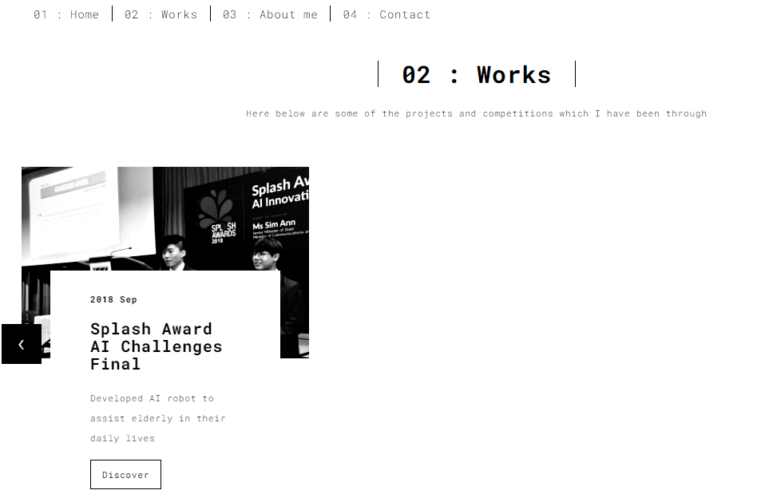

<h1 align="center">Personal Website</h1>
<p align="center">
    <a href="#features">Features</a>
    <a href="#installation">Installations</a>
</p>
This project is an experiment website to document the learning process of building a basic web app through flask. 

## Demo

- Click on Works to see the past projects


- Click on About me to see the resume


## Features

- Website shows the past competition which I have been through
- Website also shows the resume of myself

## Installation
### Pre-requiresite
- Install Git GUI, python 3.7+

### Creating virtual environment
```shell script
# Inside the Git GUI, create a directory in any location you want
mkdir /c/my_flask
# Create the virtual environment called virtual
python -m venv virtual
source virtual/Scripts/activate
```
### Install flask using pip
```shell script
pip install flask
```
## Set Up
Clone this repository into the directory you have just created and run the application, Direct to the directory and run the flask app, you will see the website up at port 5000
```shell script
flask run
```


